# 環境構築用Terraform

## 概要

本ガイドではTerraformを使用して演習環境をAWS上に構築する手順を解説します。
環境のイメージは次の通りです。

**AWS環境図**



## バージョン

本レポジトリのモジュール群は以下のバージョンを前提とします。

| Name | Version |
|------|---------|
| <a name="requirement_terraform"></a> [terraform](#requirement\_terraform) | ~> 0.15.4 |
| <a name="requirement_aws"></a> [aws](#requirement\_aws) | >= 3.53.0, < 4.0.0 |

## 使用方法

本節で具体的な使用方法を説明します。

### Docker Swarm

まず本レポジトリを任意の場所でクローンします。
なお、以降の手順では任意のディレクトリのパスを環境変数`$CLONEDIR`として進めます。

```sh
export CLONEDIR=`pwd`
git clone https://github.com/cnc4e/docker-practice.git
```

docker-swarmモジュールのディレクトリへ移動します。

``` sh
cd $CLONEDIR/docker-practice/terraform/environment/docker-swarm
```

環境構築に使用する各種パラメータを`docker-swarm.tf`に指定します。
ファイルのコメントを参考に各パラメータを指定してください。
以下に例を記載します。

``` terraform
provider "aws" {
  # 環境を構築するリージョンを指定します。
  region = "us-west-1"
}

locals {
  # common parameter
  ## 各リソースの名称やタグ情報に使用するパラメータを指定します。
  pj    = "docker-practice"
  env   = "develop"
  owner = "user01"

  tags = {
    pj    = local.pj
    env   = local.env
    owner = local.owner
  }

  # Network
  ## VPCに割り当てるCIDRを指定します。
  vpc_cidr = "10.0.0.0/16"
  ## subnetに割り当てるCIDRを指定します。
  subnet_cidr = "10.0.0.0/24"

  # EC2
  ## 作成するノードの一覧です。リストした名前のEC2を作成します。
  nodes         = ["manager0", "manager1", "manager2", "worker0", "worker1"]
  ## 作成するEC2のインスタンスタイプを指定します。
  instance_type = "t2.medium"
  ## EC2に割り当てるキーペアを指定します。あらかじめ作成が必要です。
  key_name      = "ec2_key_pair"

  # SecurityGroup
  ## 各ノードにインターネット経由でSSH接続する場合に送信元グローバルIPを指定します。
  ## どこからも許可しない場合は空配列を指定する。
  allow_ssh_cidrs        = ["119.110.104.16/28"] 
  ## 各ノードにインターネット経由でdocker APIを利用する場合に送信元グローバルIPを指定します。
  ## どこからも許可しない場合は空配列を指定する。
  allow_docker_api_cidrs = ["119.110.104.16/28"] 

  # ClowdWatch
  ## 作成するEC2に自動起動/自動停止のスケジュールを設定します。
  auto_start          = true                       # trueにするとEC2の自動起動をスケジュール設定します。
  auto_start_schedule = "cron(06 6 ? * MON-FRI *)" # 日本時間で平日09:00の指定
  auto_stop           = true                       # trueにするとEC2の自動停止をスケジュール設定します。
  auto_stop_schedule  = "cron(04 6 ? * MON-FRI *)" # 日本時間で平日19:00の指定
}
```

以下のコマンドでリソースを作成します。

``` sh
terraform init
terraform apply
> yes
```

これでSwarmクラスタの構築に必要なMnagerノード、Workerノードが作成されます。
演習に必要なコンポーネント(docker、docker-composeなど)のインストールは完了していますが、
Swarmクラスタ自体はまだ構築されていません。
[Swarm初級-Swarmクラスタの構築](../swarm-beginner/swarm-create.md)へ移動し、Swarmクラスタを実際に作成してみましょう。

### EFS

[Swarm中級-ボリューム](../swarm-intermediate/swarm-volume.md)で使用する
Amazon EFSおよび周辺設定を作成します。
こちらの章を実施しない場合、efsモジュールの実行は不要です。

まずefsモジュールのディレクトリへ移動します。

``` sh
cd $CLONEDIR/docker-practice/terraform/environment/efs
```

環境構築に使用する各種パラメータを`efs.tf`に指定します。
コメントを参考に各パラメータを指定してください。
以下に例を記載します。

``` terraform
provider "aws" {
  # 環境を構築するリージョンを指定します。
  region = "us-west-1"
}

　<中略>

locals {
  # common parameter
  ## 各リソースの名称やタグ情報に使用するパラメータを指定します。
  pj    = "docker-practice"
  env   = "develop"
  owner = "user01"

  tags = {
    pj    = local.pj
    env   = local.env
    owner = local.owner
  }
}
```

以下のコマンドでリソースを作成します。

``` sh
terraform init
terraform apply
> yes
```

これでEFSボリュームが作成されます。
[Swarm中級-ボリューム](../swarm-intermediate/swarm-volume.md)へ移動し、
コンテナへのボリュームマウントを実際に試してみましょう。

## (補足) 作成した各ノードに対する接続・操作について

この環境構築用Terraformで作成した各ノードへの操作方法は次の3つがあります。
それぞれの操作方法について本節で補足します。

1. インターネット経由でSSH接続し、各ノード上で操作する
1. AWS Session Managerを使用してコンソール接続し、ブラウザ上で操作する
1. インターネット経由でdocker APIを使用し、各ノードをリモートで操作する

### インターネット経由でSSH接続し、各ノード上で操作する

`docker-swarm.tf`において次のパラメータを指定することで、
指定した送信元グローバルIPから各ノードにSSH接続することが可能です。
ログインIDは`centos`です。認証は公開鍵暗号方式となりますので、
key_nameに指定したキーペアの秘密鍵を使用してください。

``` terraform
(該当箇所抜粋)
  ## EC2に割り当てるキーペアを指定します。あらかじめ作成が必要です。
  key_name      = "key_pair_name"

  # SecurityGroup
　## 各ノードにインターネット経由でSSH接続する場合に送信元グローバルIPを指定します。
  ## どこからも許可しない場合は空配列を指定する。
  allow_ssh_cidrs        = ["119.110.104.16/28"] 
```

### AWS Session Managerを使用してコンソール接続し、ブラウザ上で操作する

各ノードには[AWS Session Manager](https://docs.aws.amazon.com/ja_jp/systems-manager/latest/userguide/session-manager.html)を使用してコンソール接続することが可能です。

Session Managerを使用するために必要なssm agentのインストールにはuser dataを使用しています。
そのためEC2の作成・起動が完了してから、Session Managerが利用可能になるまで、
10～15分程度の時間が必要なりますのでご注意ください。

Session Managerの具体的な使用方法はこちらの[AWS公式ドキュメント セッションを開始する](https://docs.aws.amazon.com/ja_jp/systems-manager/latest/userguide/session-manager-working-with-sessions-start.html)を参照してください。

### インターネット経由でdocker APIを使用し、各ノードをリモートで操作する

dockerではAPIを外部に公開することでリモートからdockerを操作することが可能です。
API接続には`tcp 2375`(暗号化なし)、もしくは`tcp 2376`(暗号化あり)を使用します。

`docker-swarm.tf`において次のパラメータを指定することで、
指定した送信元グローバルIPからインターネット経由でdocker APIを使用することが可能になります。
インターネット経由での操作となりますので、`tcp 2376`のみ許可されます。

``` terraform
  ## 各ノードにインターネット経由でdocker APIを利用する場合に送信元グローバルIPを指定します。
  ## どこからも許可しない場合は空配列を指定する。
  allow_docker_api_cidrs = ["119.110.104.16/28"]
```

docke APIの具体的な使用方法は[こちら](https://qiita.com/moriryota62/items/7a56cdf85883582e2b93)を参照してください。
